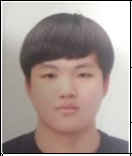

## 이력서

##성명                  ##주민등록번호
  (한글) 송지훈
  (한자) 松脂訓

##생년월일       ##병역  

20000824        복무기간 : 1년 6개월 보직 : 전차병

##현주소

경기도 시흥시 신천동 314-162번지 두리파크빌 B동 401호

##연락처

전화 : 없음 휴대폰 : 010-2014-0323

## 기간          ##학력사항         ##비고
   6년          포리초등학교졸업
   3년          소래중학교졸업
   3년          신천고등학교졸업
   3년      동양미래대학교 컴소과졸업
## 기간          ##학력사항         ##비고

            ##위의 내용이 사실과 틀림없음을 확인합니다

                     ##2022년 5월 19일
                                                 
                                                    ##지원자 : 송지훈   (인)

##자기소개서

성장배경

중학교2학년때쯤 저는 컴퓨터에 관심을 가지게 되었고 부품을 조립하고 분해하여
하드웨어에 대한 지식을 쌓아가고 고등학교에 진학을 하여 틈틈이 컴퓨터 하드웨어에대해 공부를 하여 제 자신을 점차 성장시켰고 하드웨어를 공부하다 소프트웨어에
관심이 생겨 c언어를 조금 접하였고 동양미래대를 알게되어 원하는 학과에 진학을 하여 소프트웨어대한 지식을 넒혀가 제 자신을 한층 더 발전시킬수 있었습니다.
현재는 제 지식을 증명할 자격증을 여러 개를 취득하려고 노력중입니다

##성격의 장/단점

꼼꼼함
장점 : 컴퓨터를 다루면서 어떤부분을 소홀히 하면 그부분이 나중에 큰문제가 되어
      한치 오차도 없이 완벽해야하는 꼼꼼한 성격으로 바뀌게 되었고 어떠한 작업
      을 맡게 된다면 그일을 완벽하게 하는 장점이 있습니다.
단점 : 너무 집착을 해 완벽하지않으면 그문제를 오랜시간동안 생각하고 어떻게
        해결할지 고민을 많이하고 하여 몸에 무리가 갈정도로 집착을합니다

##전공 및 경력사항

컴퓨터하드웨어 전공 컴퓨터소프트웨어 전공 포토샵전공 

##지원 동기 및 포부

이 회사를 입사하여 제 실력을 마음것 발휘하여 회사를 발전시키고 큰공을 세우고 싶습니다.

